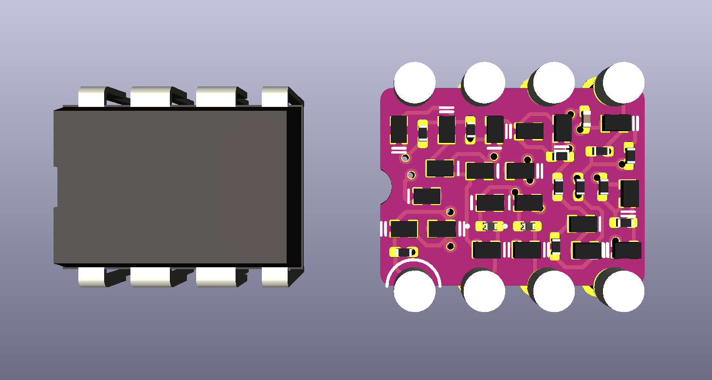

# MD741, a dis-integrated circuit

## A 741-style op-amp made of discrete components, DIP-8 size

This is a challenge posted by [Albert van Dalen](https://hackaday.io/project/177194-discrete-741-operational-amplifier-in-dil8) that is extremely silly (so, ideal for me). So, Evil Mad Scientist Labs famously [scaled up the old μA741 op-amp](https://shop.evilmadscientist.com/productsmenu/762), splitting it into discrete parts. Can it be scaled back down to DIP-8 size, but keeping the discrete parts?

More info on [Albert's personal site](https://www.avdweb.nl/div/misc2/discrete-741-operational-amplifier-in-dil8). I had to adapt the challenge a little bit; I found the SOT-723 transistors were still too big, so I switched to BJTs in the SOT-883L package (1.0mm by 0.6mm, a wee bit wider than an 0402 component). There are probably some more space savings to be gained by finding a cleverer part arrangement and by switching from KiCad's 0201 footprint to a more compact 0201 footprint.

Evil Mad Scientist Labs has a large 555 timer kit, also. It seemed only natural to tackle that one, too! [My approach to that challenge is here](https://github.com/settinger/discrete555).

TODO: Re-check design, order boards and parts if I'm feeling brave, order stencil if I'm not feeling _that_ brave, figure out how I'm going to power a ±15V op-amp without access to a benchtop power supply.

